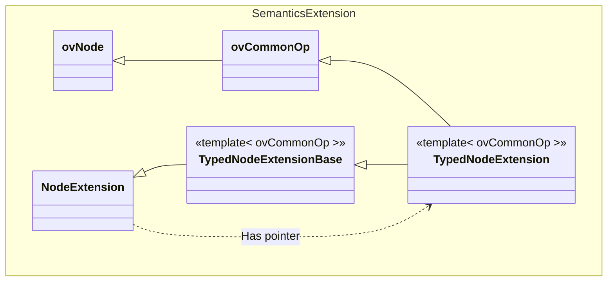
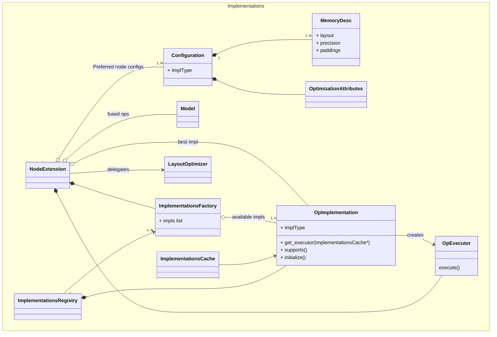
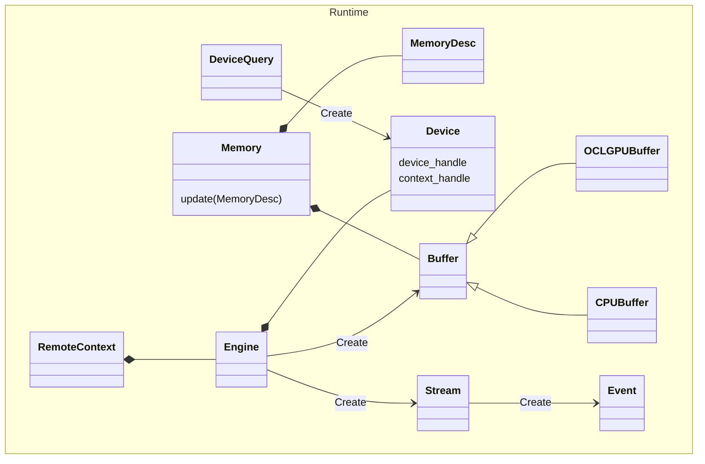

```mermaid
classDiagram
    namespace SemanticsExtension {
        class ovNode
        class NodeExtension
        class TypedNodeExtensionBase {
            <<template< ovCommonOp >>>
        }
        class TypedNodeExtension {
            <<template< ovCommonOp >>>
        }

        class ovCommonOp
    }

    ovNode <|-- ovCommonOp
    NodeExtension <|-- TypedNodeExtensionBase
    TypedNodeExtensionBase <|-- TypedNodeExtension
    ovCommonOp <|-- TypedNodeExtension
    NodeExtension  ..>  TypedNodeExtension : Has pointer
```

---------------------------

```mermaid
classDiagram
    namespace Implementations {
        class NodeExtension
        class MemoryDesc {
            + layout
            + precision
            + paddings
        }
        class Configuration {
            + ImplType
        }


        class Model
        class ImplementationsFactory {
            + impls list
        }
        class OpImplementation {
            + ImplType
            + get_executor(ImplementationsCache*)
            + supports()
            + initialize()
        }
        class ImplementationsCache {

        }
        class ImplementationsRegistry {

        }
        class OptimizationAttributes
        class LayoutOptimizer
        class OpExecutor {
            execute()
        }


    }

    Configuration "1" *-- "1..N" MemoryDesc
    Configuration *-- OptimizationAttributes

    NodeExtension o-- Model : fused ops
    NodeExtension o-- "1..N" Configuration : Preferred node configs
    NodeExtension *-- ImplementationsFactory
    NodeExtension --> LayoutOptimizer : delegates
    NodeExtension o-- OpImplementation : best impl
    ImplementationsFactory o-- "1..N" OpImplementation : available impls
    OpImplementation --> OpExecutor : creates
    ImplementationsCache --> OpImplementation
    ImplementationsRegistry "1" --> "1..N" ImplementationsFactory
    ImplementationsRegistry *-- OpImplementation
    OpExecutor --* NodeExtension

```

---------------------------

```mermaid
classDiagram
    namespace Runtime {
        class Engine
        class Memory {
            update(MemoryDesc)
        }
        class Buffer
        class OCLGPUBuffer
        class CPUBuffer
        class MemoryDesc
        class Stream
        class Event
        class RemoteContext
        class Device {
            device_handle
            context_handle
        }
        class DeviceQuery
    }

    Memory *-- MemoryDesc
    DeviceQuery -->  Device : Create
    Engine *-- Device
    Memory *-- Buffer
    Buffer <|-- OCLGPUBuffer
    Buffer <|-- CPUBuffer
    Engine --> Buffer : Create
    Engine --> Stream : Create
    Stream --> Event : Create
    RemoteContext *-- Engine
```
