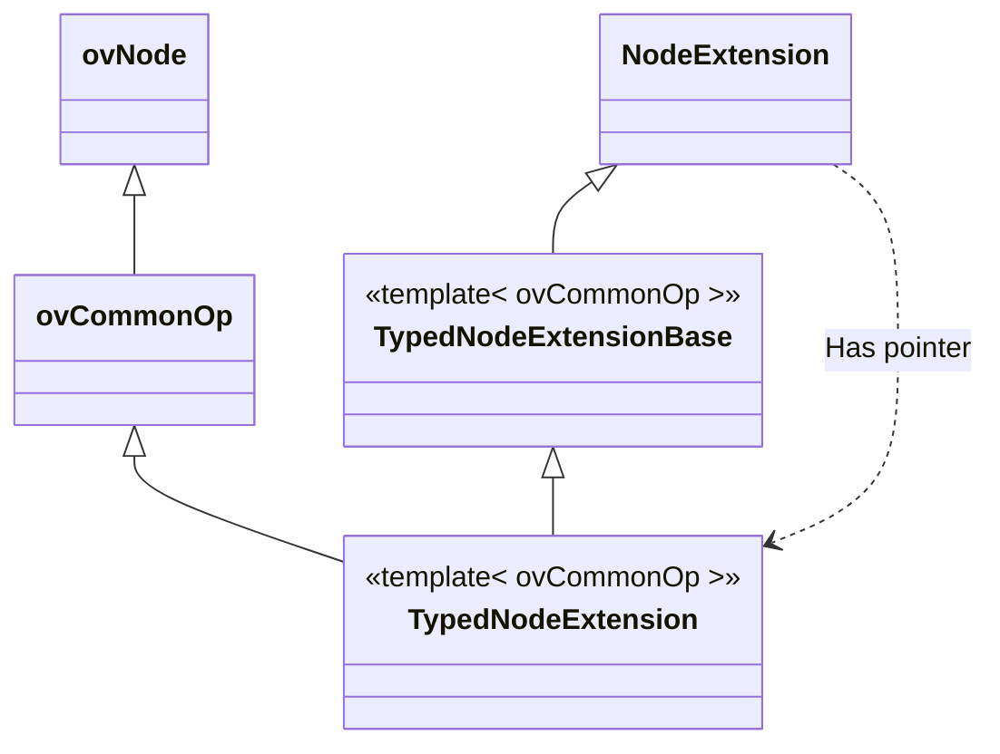
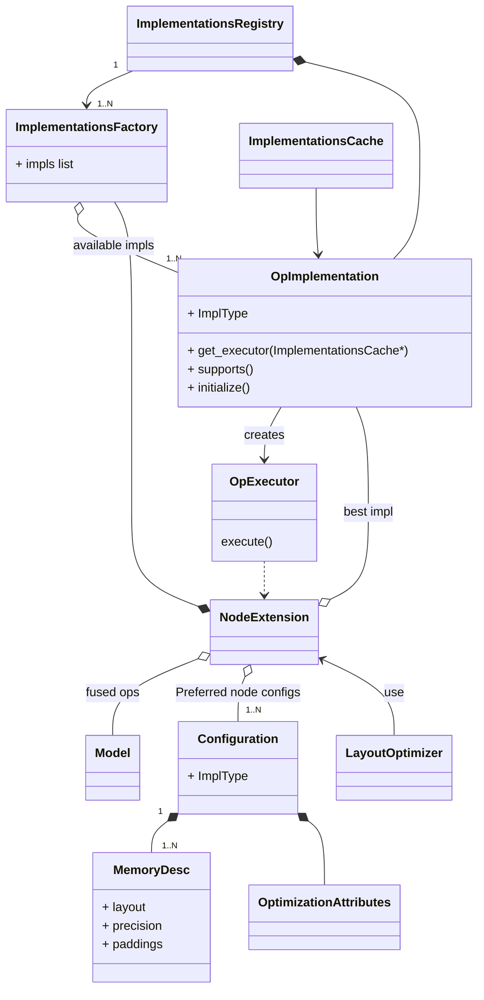

```mermaid
classDiagram
    class ovNode
    class NodeExtension
    class TypedNodeExtensionBase {
        <<template< ovCommonOp >>>
    }
    class TypedNodeExtension {
        <<template< ovCommonOp >>>
    }

    class ovCommonOp

    ovNode <|-- ovCommonOp
    NodeExtension <|-- TypedNodeExtensionBase
    TypedNodeExtensionBase <|-- TypedNodeExtension
    ovCommonOp <|-- TypedNodeExtension
    NodeExtension  ..>  TypedNodeExtension : Has pointer
```

---------------------------

```mermaid
classDiagram
    class MemoryDesc {
        + layout
        + precision
        + paddings
    }
    class Configuration {
        + ImplType
    }

    Configuration "1" *-- "1..N" MemoryDesc
    Configuration *-- OptimizationAttributes

    class Model
    class ImplementationsFactory {
        + impls list
    }
    class OpImplementation {
        + ImplType
        + get_executor(ImplementationsCache*)
        + supports()
        + initialize()
    }
    class ImplementationsCache {

    }
    class ImplementationsRegistry {

    }
    class OptimizationAttributes
    class LayoutOptimizer
    class OpExecutor {
        execute()
    }

    class NodeExtension

    NodeExtension o-- Model : fused ops
    NodeExtension o-- "1..N" Configuration : Preferred node configs
    NodeExtension *-- ImplementationsFactory
    NodeExtension <-- LayoutOptimizer : use
    NodeExtension o-- OpImplementation : best impl
    ImplementationsFactory o-- "1..N" OpImplementation : available impls
    OpImplementation --> OpExecutor : creates
    ImplementationsCache --> OpImplementation
    ImplementationsRegistry "1" --> "1..N" ImplementationsFactory
    ImplementationsRegistry *-- OpImplementation
    OpExecutor ..> NodeExtension

```
