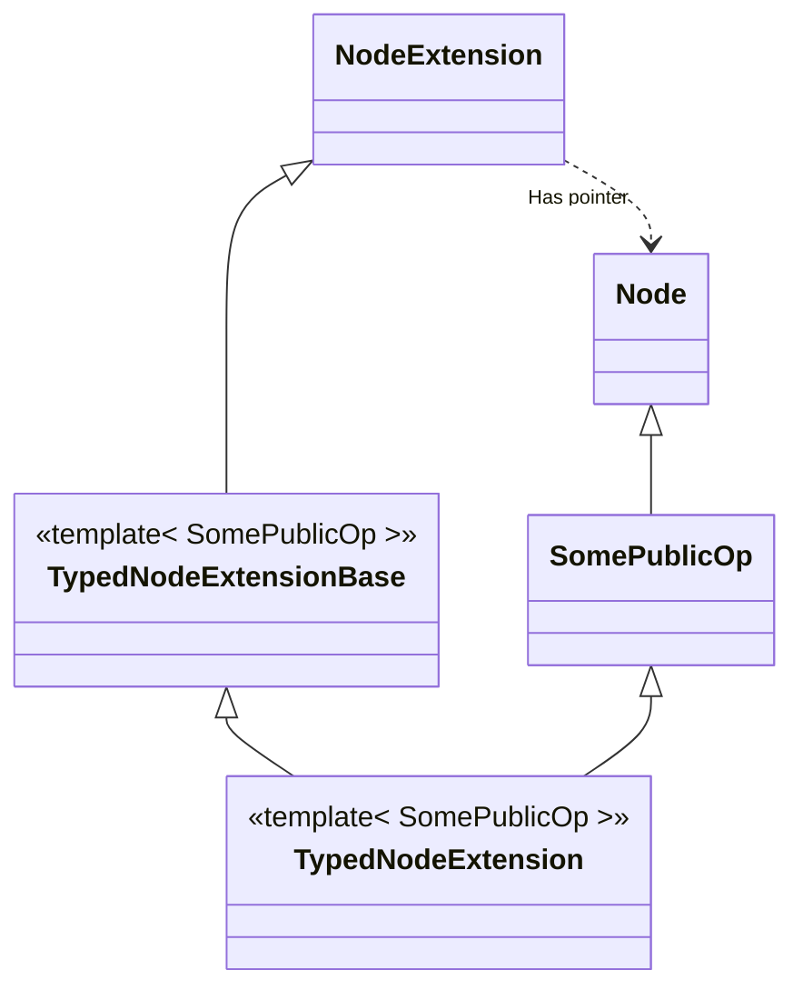
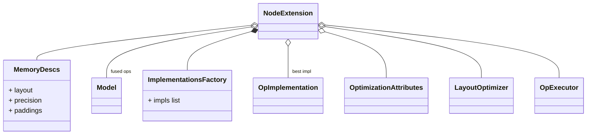

```mermaid
classDiagram
    class Node
    class NodeExtension
    class TypedNodeExtensionBase {
        <<template< SomePublicOp >>>
    }
    class TypedNodeExtension {
        <<template< SomePublicOp >>>
    }

    class SomePublicOp

    Node <|-- SomePublicOp
    NodeExtension <|-- TypedNodeExtensionBase
    TypedNodeExtensionBase <|-- TypedNodeExtension
    SomePublicOp <|-- TypedNodeExtension
    NodeExtension  "Has pointer" ..>  Node
```

---------------------------

```mermaid
classDiagram
    class MemoryDescs {
        + layout
        + precision
        + paddings
    }

    class Model
    class ImplementationsFactory {
        + impls list
    }
    class OpImplementation
    class OptimizationAttributes
    class LayoutOptimizer
    class OpExecutor

    class NodeExtension

    NodeExtension o-- MemoryDescs
    NodeExtension o-- "fused ops" Model
    NodeExtension *-- ImplementationsFactory
    NodeExtension o-- "best impl" OpImplementation
    NodeExtension o-- OptimizationAttributes
    NodeExtension o-- LayoutOptimizer
    NodeExtension o-- OpExecutor

```
