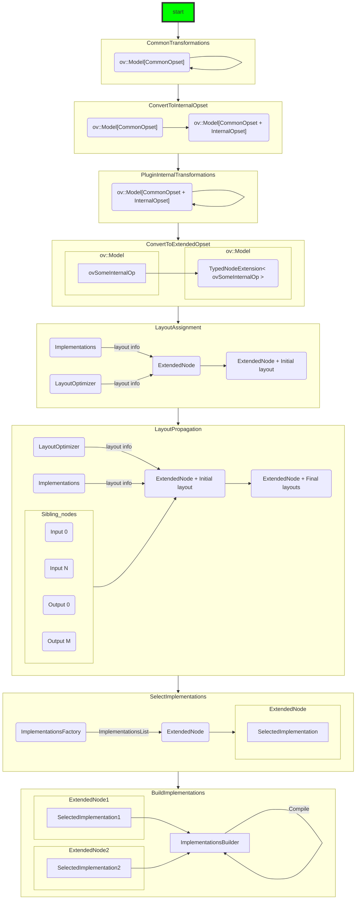

```mermaid
flowchart TB
    subgraph CommonTransformations
        direction LR
        m("ov::Model[CommonOpset]") --> m
    end
    subgraph ConvertToInternalOpset
        direction LR
        m1("ov::Model[CommonOpset]") --> m2("ov::Model[CommonOpset + InternalOpset]")
    end
    subgraph PluginInternalTransformations
        direction LR
        m3("ov::Model[CommonOpset + InternalOpset]") --> m3
    end
    subgraph ConvertToExtendedOpset
        direction LR
        subgraph common [ov::Model]
            direction LR
            ovSomeInternalOp
        end
        subgraph ext [ov::Model]
            direction LR
            ext_node("TypedNodeExtension< ovSomeInternalOp >")
        end

        ovSomeInternalOp --> ext_node

    end
    subgraph LayoutAssignment
        direction LR
        impl("Implementations") -- "layout info" --> n1("ExtendedNode")
        lo("LayoutOptimizer") -- "layout info" --> n1("ExtendedNode")
        n1("ExtendedNode") --> n2("ExtendedNode + Initial layout")
    end
    subgraph LayoutPropagation
        direction LR
        subgraph Sibling_nodes
            direction LR
            in_0("Input 0")
            in_n("Input N")
            out_0("Output 0")
            out_m("Output M")
        end
        n3("ExtendedNode + Initial layout")
        n4("ExtendedNode + Final layouts")
        Sibling_nodes --> n3
        lo1("LayoutOptimizer") -- "layout info" --> n3
        impl1("Implementations") -- "layout info" --> n3
        n3 --> n4
    end

    subgraph SelectImplementations
        direction LR
        n5("ExtendedNode")
        impl2("ImplementationsFactory") -- "ImplementationsList"--> n5
        subgraph ExtendedNode
            SelectedImplementation
        end
        n5 --> ExtendedNode
    end

    subgraph BuildImplementations
        direction LR
        subgraph ExtendedNode1
            SelectedImplementation1
        end
        subgraph ExtendedNode2
            SelectedImplementation2
        end

        SelectedImplementation1 --> ImplementationsBuilder
        SelectedImplementation2 --> ImplementationsBuilder
        ImplementationsBuilder -- "Compile" --> ImplementationsBuilder
    end

    start --> CommonTransformations --> ConvertToInternalOpset --> PluginInternalTransformations
    style start fill:#00ff00,stroke:#333,stroke-width:4px
    PluginInternalTransformations --> ConvertToExtendedOpset -->
    LayoutAssignment --> LayoutPropagation --> SelectImplementations --> BuildImplementations
```
