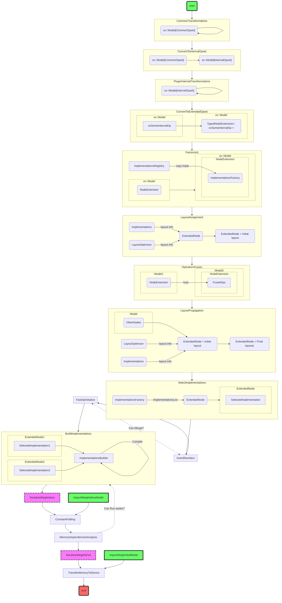

```mermaid
flowchart TB
    subgraph CommonTransformations
        direction LR
        m("ov::Model[CommonOpset]") --> m
    end
    subgraph ConvertToInternalOpset
        direction LR
        m1("ov::Model[CommonOpset]") --> m2("ov::Model[InternalOpset]")
    end
    subgraph PluginInternalTransformations
        direction LR
        m3("ov::Model[InternalOpset]") --> m3
    end
    subgraph ConvertToExtendedOpset
        direction LR
        subgraph common [ov::Model]
            direction LR
            ovSomeInternalOp
        end
        subgraph ext [ov::Model]
            direction LR
            ext_node("TypedNodeExtension< ovSomeInternalOp >")
        end

        ovSomeInternalOp --> ext_node

    end
    subgraph FactoryInit
        direction LR
        ImplementationsRegistry
        subgraph ext1 [ov::Model]
            direction LR
            ext_node1("NodeExtension")
        end
        subgraph ext2 [ov::Model]
            direction LR
            subgraph ext_node3 [NodeExtension]
                direction LR
                factory("ImplementationsFactory")
            end
        end

        ext1 --> ext2
        ImplementationsRegistry --"copy impls"--> factory

    end
    subgraph LayoutAssignment
        direction LR
        impl("Implementations") -- "layout info" --> n1("ExtendedNode")
        lo("LayoutOptimizer") -- "layout info" --> n1("ExtendedNode")
        n1("ExtendedNode") --> n2("ExtendedNode + Initial layout")
    end
    subgraph OperatorsFusion
        direction LR
        subgraph Model1
            node1("NodeExtension")
        end
        subgraph Model2
            direction LR
            subgraph node2 [NodeExtension]
                FusedOps
            end
        end

        node1 --"fuse"--> FusedOps
    end
    subgraph LayoutPropagation
        direction LR
        subgraph Model
            direction LR
            other_nodes("OtherNodes")
        end
        n3("ExtendedNode + Initial layout")
        n4("ExtendedNode + Final layouts")
        other_nodes --> n3
        lo1("LayoutOptimizer") -- "layout info" --> n3
        impl1("Implementations") -- "layout info" --> n3
        n3 --> n4
    end

    subgraph SelectImplementations
        direction LR
        n5("ExtendedNode")
        impl2("ImplementationsFactory") -- "ImplementationsList"--> n5
        subgraph ExtendedNode
            SelectedImplementation
        end
        n5 --> ExtendedNode
    end

    subgraph InsertReorders
        direction LR
    end

    subgraph FastOpInitialize
        direction LR
    end

    subgraph BuildImplementations
        direction LR
        subgraph ExtendedNode1
            SelectedImplementation1
        end
        subgraph ExtendedNode2
            SelectedImplementation2
        end

        SelectedImplementation1 --> ImplementationsBuilder
        SelectedImplementation2 --> ImplementationsBuilder
        ImplementationsBuilder -- "Compile" --> ImplementationsBuilder
    end

    start_flow("start") --> CommonTransformations --> ConvertToInternalOpset -->
    PluginInternalTransformations --> ConvertToExtendedOpset --> FactoryInit -->
    LayoutAssignment --> OperatorsFusion --> LayoutPropagation --> SelectImplementations -->
    InsertReorders --> FastOpInitialize --> BuildImplementations --> SerializeWeightsless -->
    ConstantFolding --> MemoryDependenciesAnalysis --> SerializeWeightsFull --> TransferMemoryToDevice --> end_flow("end")


    MemoryDependenciesAnalysis -. Can Run earlier? .-> BuildImplementations
    FastOpInitialize <-. Can Merge? .-> InsertReorders

    ImportWeightslessModel --> ConstantFolding
    ImportWeightsfullModel --> TransferMemoryToDevice


    style start_flow fill:#6f6,stroke:#333,stroke-width:4px
    style ImportWeightslessModel fill:#6f6,stroke:#333,stroke-width:4px
    style ImportWeightsfullModel fill:#6f6,stroke:#333,stroke-width:4px
    style end_flow fill:#f66,stroke:#333,stroke-width:4px
    style SerializeWeightsless fill:#f7f,stroke:#333,stroke-width:4px,stroke-dasharray: 5 5
    style SerializeWeightsFull fill:#f7f,stroke:#333,stroke-width:4px,stroke-dasharray: 5 5
```
